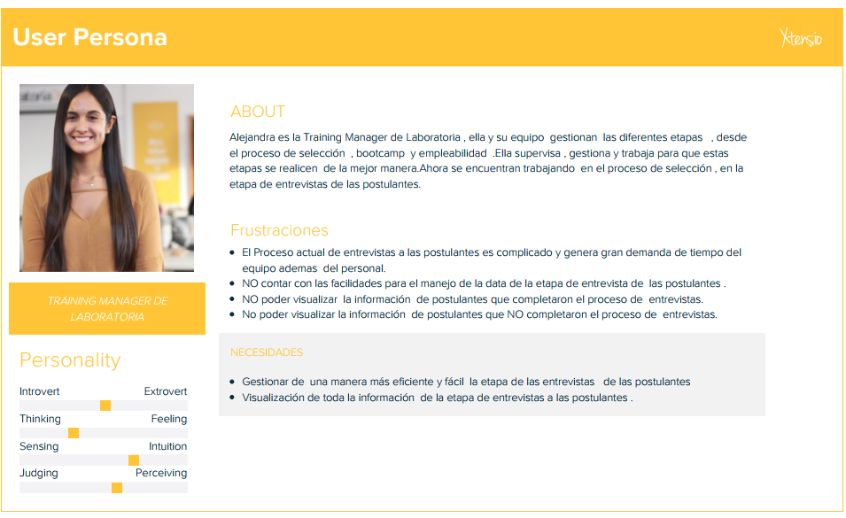
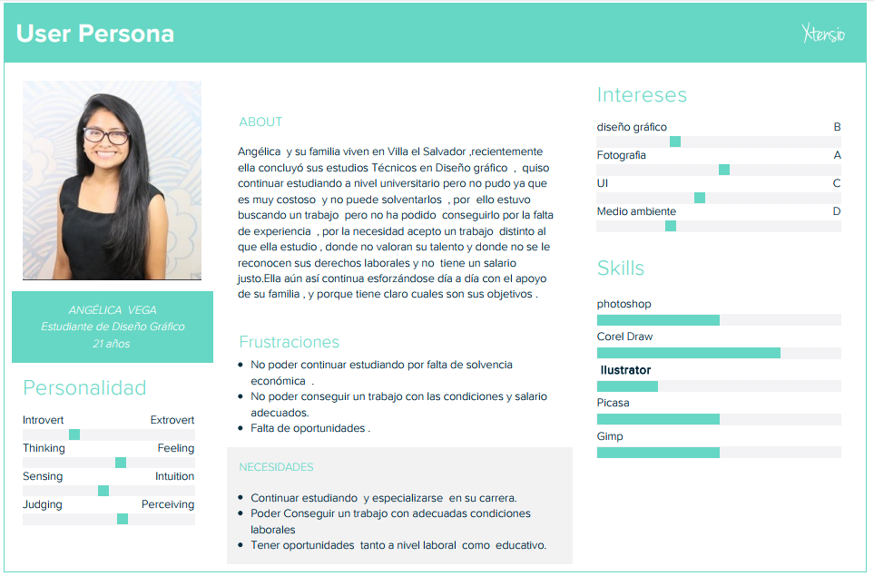
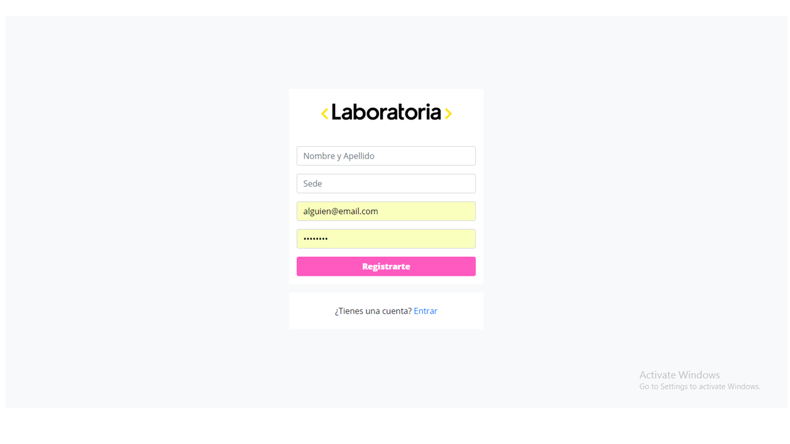
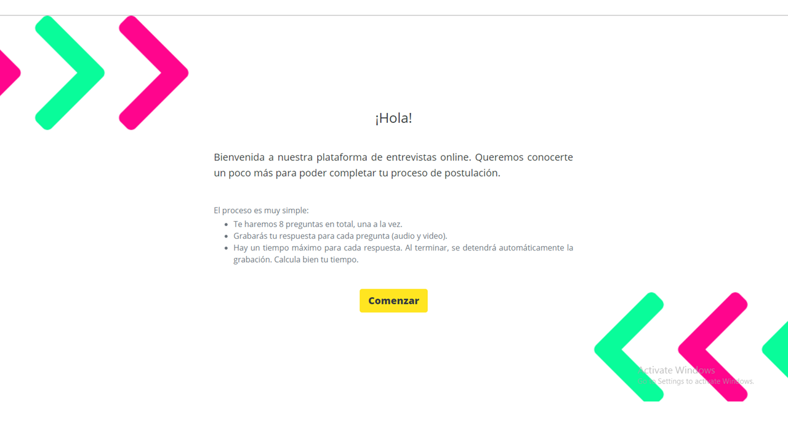
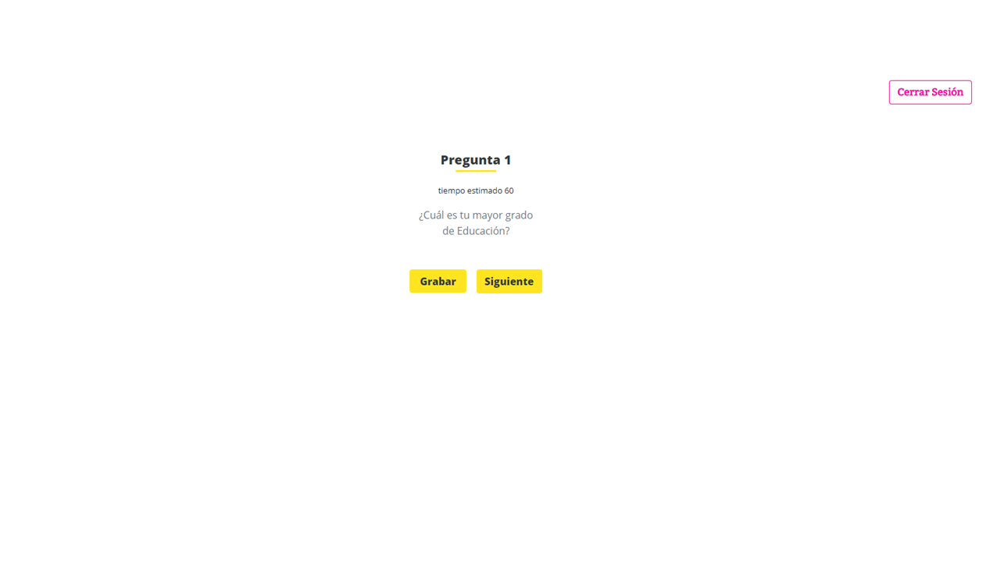
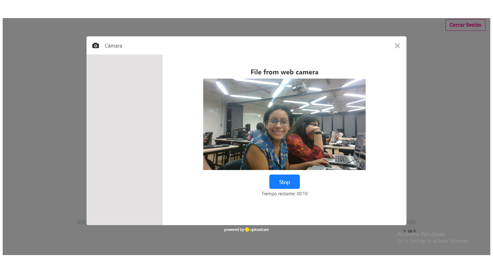
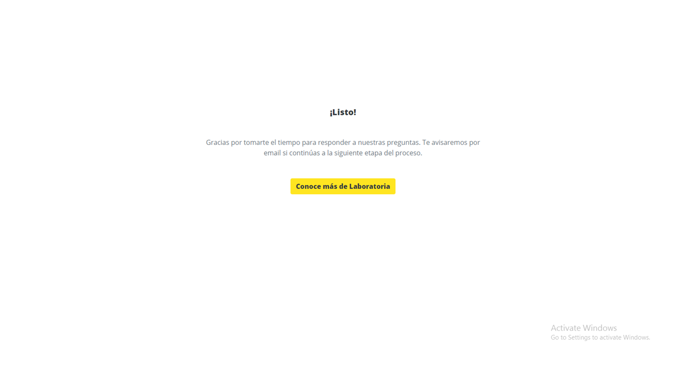

# ENTREVISTAS ONLINE
Plataforma para realizar entrevistas online diseñado  para Laboratoria .

### CONTEXTO
Esta plataforma es creada para ayudar al equipo de Laboratoria y a la training Manager  a gestionar el manejo del proceso de entrevistas a las postulantes, actualmente  las entrevistas  se realizan  personalmente con las psicólogas , para mejorar  este proceso creamos  esta plataforma  , donde las entrevistas a las postulantes podrán realizarse de manera online  (audio y video) ,facilitando  a la vez el manejo de la información .

### PÚBLICO OBJETIVO
-	Trainig Manager de Laboratoria
-	Postulantes

### STAKEHOLDERS
- Equipo de Laboratoria
- Training Manager
- Administrador
- Psicólogas
- Equipo de desarrollo
- Postulantes

## DESCUBRIMIENTO E INVESTIGACIÓN

### USER PERSONA 1
(Trainig Manager)

### USER PERSONA 2
(Postulante)

### PROBLEM STATEMENTS

**TRAINING MANAGER**

**{Alejandra}** quisiera poder mejorar el manejo y gestión de cada etapa del proceso de selección para ahorrar tiempo y recursos.

**{Alejandra}** quisiera  poder manejar toda la información del proceso de selección de las postulantes de una manera eficiente y fácil.

**{Alejandra}** quisiera tener toda la información del proceso de entrevistas de las postulantes.

**{Alejandra}** quisiera poder  visualizar la cantidad de postulantes que son aptas o no  para la etapa de las  entrevistas.

**POSTULANTE**

**{Angélica}** quisiera poder tener más oportunidades laborales.

**{Angélica}** quisiera poder encontrar un trabajo con las condiciones adecuadas.

**{Angélica}** quisiera poder tener más oportunidades educativas y continuar con sus estudios.

### HOW MIGHT WE (HMW)

**¿Cómo podríamos**  lograr mejorar la etapa del proceso de entrevistas a las postulantes?

**¿Cómo podríamos**  brindarle toda la información del proceso de entrevistas de una manera sencilla y eficiente?

**¿Cómo podríamos**  lograr que sea visible la cantidad  de postulantes que son aptas o no para la etapa de entrevistas?

### IDEACIÓN 
#### Feature List
#### Modulo del postulante
-	Registro y login con correo electrónico, Facebook y Gmail.
-	Selección de 8 preguntas de forma aleatoria.
-	Grabación de audio y video de cada respuesta de la postulante 
-	Almacenamiento de las entrevistas completas e incompletas

#### Modulo del training manager
-	Dashboard de visualización de las cantidades de postulantes aptas para entrevista, con entrevistas incompleta y completas.
-	Visualización de la lista de postulantes aptas para entrevistas.
-	Visualización de la lista de postulantes con entrevistas incompletas con opción a comentar y reproducir el video.
-	Visualización de la lista de postulantes con entrevistas completas con opción a comentar, reproducir el video e indicar si paso a la siguiente etapa.

#### Storytelling
Angélica   es una postulante que planea ingresar a Laboratoria, es la primera vez que postula y está motivada por lograr ser una UX Designer capacitada para empezar su carrera en el mundo tech.
Ha completado exitosamente el trabajo con mucho esfuerzo y le han enviado un correo con un link para realizar la entrevista online.
Está ansiosa por las preguntas que le realizarán sin embargo ha leído las recomendaciones atentamente y contestará desde la comodidad de su casa. 
Esto evita que ella se traslade a la sede de Laboratoria y aproveche mejor su tiempo en seguir practicando para lograr ingresar a Laboratoria.
Por otro lado, Alejandra es training manager de Laboratoria Lima y junto a su equipo se dedica a entrevistar a todas las postulantes al bootcamp.
Afortunadamente ahora existe el método de entrevistas online, lo cual le permitirá revisar el video de todas las entrevistadas desde cualquier lugar y en cualquier momento. Además de comentar algunas observaciones en el video.
Para ambas partes las entrevistas online son una opción muy cómoda debido a que no deben movilizarse ni asignar un horario determinado a realizarla.
### PROTOYPING
#### Situación actual
Se encuentra en el siguiente link : https://team-laboratoria.github.io/Entrevista-online/views/welcome.html
-	Actualmente el MVP posee las siguientes características:

No indica en que parte se encuentra el error en caso de que no permita loguearse, no permite indicar de forma correcta la sede a la que esta postulando 

Las indicaciones no eran comprensibles por los usuarios , pues no quedaba claro la cantidad de tiempo que tenia para leer la pregunta y para contestarla 

Poseía el botón “Cerrar Sesión”, que se considera innecesario porque la plataforma solo es para la entrevista online y no habría motivo para que inicie sesión nuevamente

Para grabar la entrevista  es necesario que pulse el botón “Record a video”

Para enviar el video se debe presionar “Stop” y lo enviará automáticamente

Al terminar nos muestra un mensaje de agradecimiento y un botón para conocer más de Laboratoria.
 #### Modulo del postulante
-	La primera versión de nuestro prototipo es la siguiente: https://marvelapp.com/5030i4j
-	Luego de realizar el testing (https://www.youtube.com/watch?v=TWsO--qDl4g) obtuvimos el siguiente feedback 

1.	 Confusion de la barra de progreso con el tiempo para leer la pregunta
2.	Le parecio necesario un botón para que en el caso que lea la pregunta antes del tiempo dado (15 segundos) pueda grabar.
3.	No fue clara la imagen del timer con el tiempo restante.
4.	Respecto a las indicaciones al principio no quedaban claras en cuanto al tiempo disponible para leer la pregunta y para contestarla.
5.	Confusion en la barra de progreso debe indicar la cantidad de preguntas que van hasta el momento.

-	La segunda versión de nuestro prototipo es la siguiente: https://marvelapp.com/872652e/screen/40358512
-	Caracteristicas finales 
1.	Permite logueo con Facebook y google 
2.	Las indicaciones están más claras, puesto que especifica la cantidad de tiempo para leer la pregunta y para contestarla.
3.	Se añadió un mensaje de advertencia para que tenga conectado el micro y la cámara de la  PC.
4.	Se incluyó un botón en caso termine de leer la pregunta en menos tiempo.
5.	Se eliminó el botón “Cerrar Sesión” pues indicaron los usuarios que era innecesario ya que solo se debe loguear para realizar la entrevista.

#### Modulo del training manager
-	La primera versión de nuestro prototipo es la siguiente:
https://marvelapp.com/6542cd1/screen/40317684
-	Luego de realizar el testing (https://www.youtube.com/watch?v=5R9WndTGI74) obtuvimos el siguiente feedback 

1.	 Confusión en los títulos pues no indican que proceso de selección es ni la sede.
2.	Que permita marcar que el video ya fue visualizado 
3.	Me dé opciones de añadir comentarios a los videos.
4.	Es muy cómodo que se visualice el video y la lista de preguntas de cada postulante.

-	La segunda versión de nuestro prototipo es la siguiente: https://marvelapp.com/3bcc52a/screen/40377555
-	Caracteristicas finales :
1.	Se incluyo botones que permitan visualizar la lista de postulantes aptas para entrevista, entrevistas incompletas y completas.
2.	Permite visualizar los videos de aquellas postulantes que poseen videos de entrevista.

